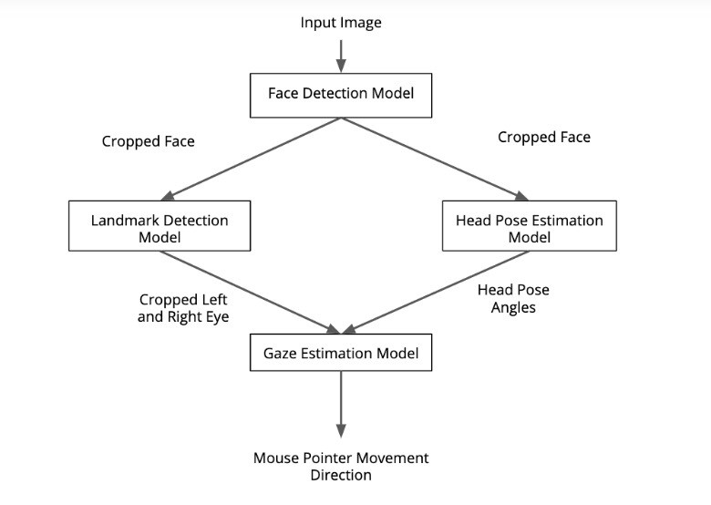
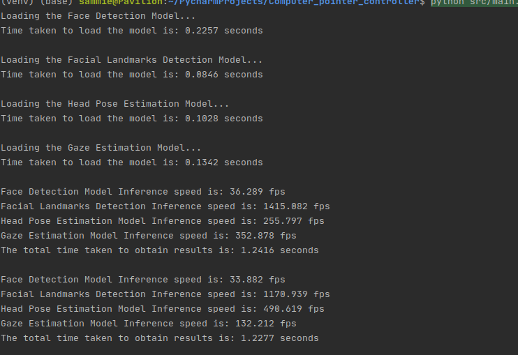
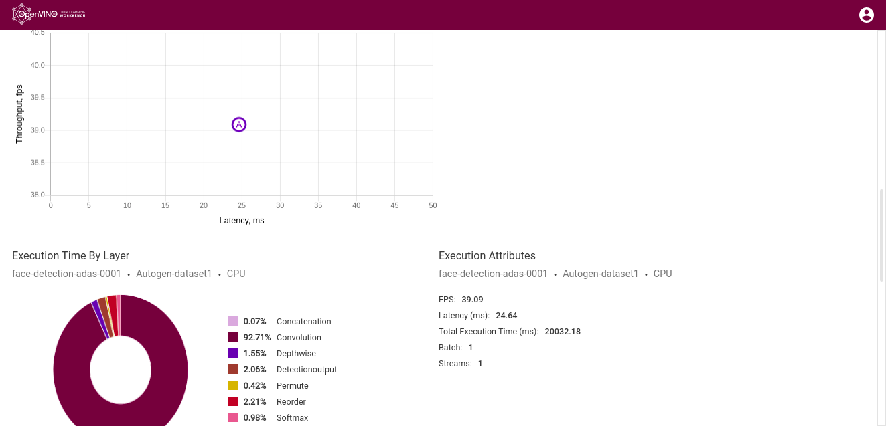
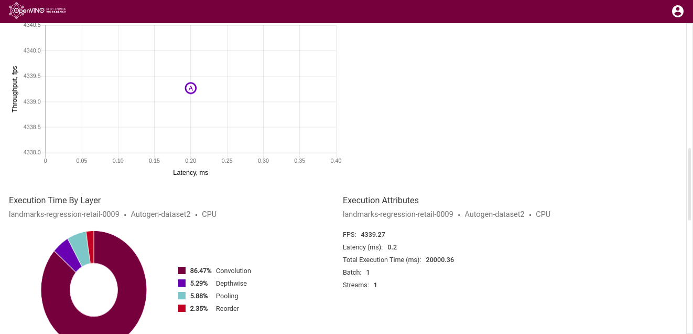
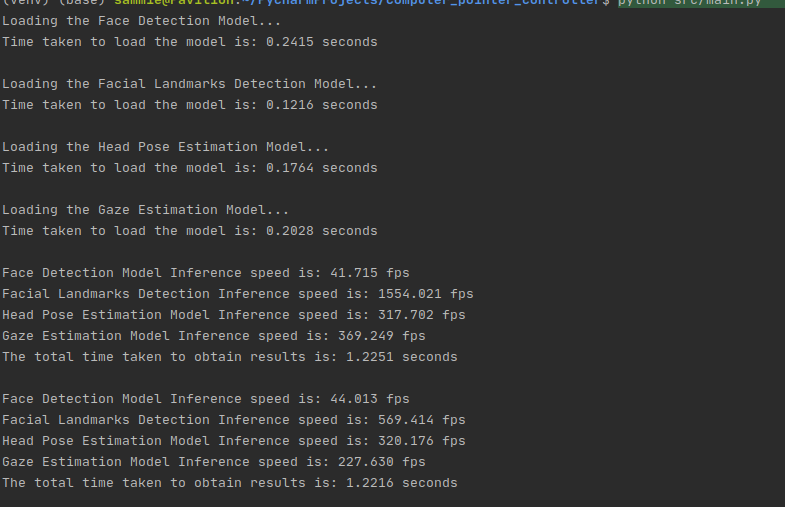
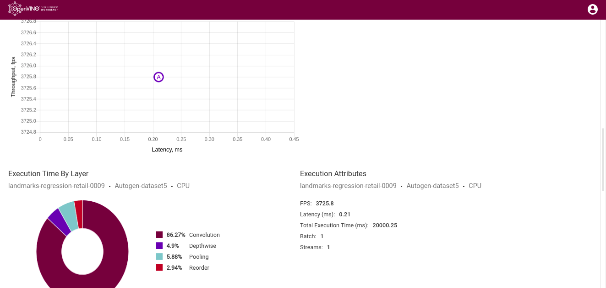
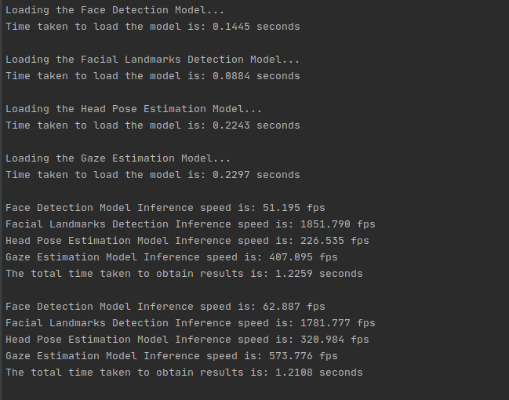

# Computer Pointer Controller

This project controls a computer's pointer using the gaze of the eyes. To accomplish this, four pre-trained 
models from the [Intel Pre-trained Models Zoo](https://software.intel.com/content/www/us/en/develop/tools/openvino-toolkit/pretrained-models.html) have to be used.

- [Face Detection](https://docs.openvinotoolkit.org/latest/_models_intel_face_detection_adas_binary_0001_description_face_detection_adas_binary_0001.html)
- [Head Pose Estimation](https://docs.openvinotoolkit.org/latest/_models_intel_head_pose_estimation_adas_0001_description_head_pose_estimation_adas_0001.html)
- [Facial Landmarks Detection](https://docs.openvinotoolkit.org/latest/_models_intel_landmarks_regression_retail_0009_description_landmarks_regression_retail_0009.html)
- [Gaze Estimation Model](https://docs.openvinotoolkit.org/latest/_models_intel_gaze_estimation_adas_0002_description_gaze_estimation_adas_0002.html)



## Project Set Up and Installation

The installation instructions for the [OpenVINO Toolkit](https://docs.openvinotoolkit.org/latest/index.html), 
can be found [here](https://docs.openvinotoolkit.org/latest/index.html)

This project utilizes the InferenceEngine API from Intel's OpenVino ToolKit to build the project. 
The gaze estimation model requires three inputs:
 - Image of the right eye
 - Image of the left eye
 - The head pose
 
Start by cloning [this GitHub Repo](https://github.com/sam505/Computer_pointer_controller). This repository contains
 all the pre-trained models required to run the project on your machine locally. In addition to that, 
 it contains the required packages that you will have to install to run this project without encountering errors.
    
Luckily, for this project all the required packages have been set up in the virtual environment. 
There are four main directories for this project
- [bin](bin) ~ This contains the video input video to test the app and also has a directory containing images 
illustrating how the project works
- [models](models) ~ This contains all the pre-trained models required to run the project. They have been downloaded 
from the [Intel Pre-trained Models Zoo](https://software.intel.com/content/www/us/en/develop/tools/openvino-toolkit/pretrained-models.html)
   
    - [Face Detection](https://docs.openvinotoolkit.org/latest/_models_intel_face_detection_adas_binary_0001_description_face_detection_adas_binary_0001.html)
    - [Head Pose Estimation](https://docs.openvinotoolkit.org/latest/_models_intel_head_pose_estimation_adas_0001_description_head_pose_estimation_adas_0001.html)
    - [Facial Landmarks Detection](https://docs.openvinotoolkit.org/latest/_models_intel_landmarks_regression_retail_0009_description_landmarks_regression_retail_0009.html)
    - [Gaze Estimation Model](https://docs.openvinotoolkit.org/latest/_models_intel_gaze_estimation_adas_0002_description_gaze_estimation_adas_0002.html)
    
- [src](src) ~ Contains all the python files required to control the flow of data from either the video file, webcam 
feed or an image through the four models and obtain results that will be used to control the computer pointer.
There are 7 python files all performing different tasks. Running the app, loading the four different models, 
loading the input file and the last one controls the computer pointer.
- [venv](venv) ~ The virtual environment folder that contains all additional packages required while running the project

- There is a [Readme](README.md) and a [requirements file](requirements.txt)

    To install the required packages listen in the requirements file use
    
     ```commandline
    pip install PACKAGE_NAME
    ```


## Demo

These are the possible ways to run this project. 
- Running the [main](src/main.py) python file using a command line argument.
Before that, assuming that you have already installed the [OpenVINO Toolkit](https://docs.openvinotoolkit.org/latest/index.html),
source the OpenVINO Environment using
```commandline
source /opt/intel/openvino/bin/setupvars.sh -pyver 3.6
```
Afterwards, run the main python file using either of the following command lines

   - To run the project using the webcam as the input type, use the following the command line. 
   The command line argument specifying the input type is required to tun the main python file
        ```commandline
        python src/main.py --input_type cam
        ```
        While using the video or an image as the input type, a command line argument specifying the directory 
   path of the input video or input image has to be specified by using one of the following command lines. 
   For an image file specify the command line argument `--input_type` as video and add the path to the video in the `--input_type` command line argument
   
        ```commandline
        python src/main.py --input_type video --input_file path_to_video_file
        ```
        
        For an image file specify the command line argument `--input_type` as image and add the path to the image in the `--input_type` command line argument
        
        ```commandline
        python src/main.py --input_type image --input_file path_to_image_file
        ```
## Documentation

The project requires different command line arguments depending on your desired input file to the project. 
- While using the webcam as the input feed source, to run the main python file, a command line argument `--input_type` 
has to be added with the parameter `cam` to specify the input type as webcam.

- To use a video file as the source of the input feed, running the main python file though the command line, a command
 line argument `--input_type` has to be added with the parameter `video` to specify the input type as video. In addition to that, 
 to use a different video or the one in the project directory, add the path to the video file to the `--input_file` command line argument.
 
- To use a image file as the source of the input feed, running the main python file though the command line, a command
 line argument `--input_type` has to be added with the parameter `image` to specify the input type as an image. In addition to that, 
 add the path to the image file to the `--input_file` command line argument.


## Benchmarks
*TODO:* Include the benchmark results of running your model on multiple hardwares and multiple model precisions. 
Your benchmarks can include: model loading time, input/output processing time, model inference time etc.
### FP32 Results
The face detection model uses one precision, that is, FP32-INT1. The loading time and the inference time for the
 model remains the same.
 
- Results for all the models have been calculated while running the project and are as shown below.
 
     

   - Face Detection Model Deep Learning Workbench Results using FP32-INT1 as the model precision.
 
     

   - Facial Landmarks Detection Model Deep Learning Workbench results using FP32 as the model precision
     
   
   - Head Pose Estimation Model Deep Learning Workbench Results using FP32 as the model precision
   
     
   
   - Gaze Estimation Model Deep Learning Workbench Results using FP32 as the model precision
 
     
 
### FP16 Results
- Below are the results for running the project using FP16 as the model precision
 
    
    
    - Facial Landmarks Detection Model Deep Learning Workbench results using FP32 as the model precision
      
    
    - Head Pose Estimation Model Deep Learning Workbench Results using FP32 as the model precision
      
      
    - Gaze Estimation Model Deep Learning Workbench Results using FP32 as the model precision
      

### FP16-INT8 Results
- Below are the results for running the project using FP16-INT8 as the model precision

    
    
    - Facial Landmarks Detection Model Deep Learning Workbench results using FP32 as the model precision
       
       
    - Head Pose Estimation Model Deep Learning Workbench Results using FP32 as the model precision
      
      
    - Gaze Estimation Model Deep Learning Workbench Results using FP32 as the model precision
      

## Results
*TODO:* Discuss the benchmark results and explain why you are getting the results you are getting. 
For instance, explain why there is difference in inference time for FP32, FP16 and INT8 models.

## Stand Out Suggestions
- ### Build an Inference Pipeline for both video file and webcam feed as input:
    I have given the user an option to choose the type of media they would like to feed to the project by the use of a 
command line argument. Besides that, the user can also add the path to another video file or image file
 using a command line argument.
 
- ### Can you improve your inference speed without significant drop in performance by changing the precision of the models?
    It is possible to improve the inference speed without experiencing a significant drop in performance. 
    I have run the app using different models precisions and calculated the time it takes to obtain results on 
    different model precision combinations. I have run the project with FP32 for all models and the time taken to run 
    inference on all 4 models and obtain results ranges from `1.2277 - 1.2416 seconds`. The average is `1.23465 seconds`
    
    When using FP16 as the models precision, the total time taken to run an inference on all models ranges from
    `1.2216 - 1.2251 seconds`. The average is `1.22335 seconds`
    
    Lastly, when using the FP16-INT8 models precision, the total time taken to run one inference across all models 
    ranges from `1.2108 - 1.2259 seconds`. The average is `1.21835 seconds`
    
    Clearly, it is possible to improve the general performance of the project by reducing the model precision
     and the performance will almost be the same. There are no instances where a face was not detected or the mouse
      failed to move while running on FP16-INT8 as the models precision.
### Async Inference

   I have used Async Inference to load each frame per model and obtain the results. This ensures that the time taken to 
   run the app is quite small compared to when running synchronous inference requests. It is efficient in that the mouse 
   controller does not have to wait for inference to be performed and results obtained on all the models. Inference is 
   performed on a single frame and the results sent to the relevant model, inference starts on that model sending results 
   to the next model and the results sent to the pointer controller python file. This reduces the time it takes to run the 
   project, and as a result, saving the power consumed and having a significant boost on the performance.

### Edge Cases
There will be certain situations that will break your inference flow. For instance, 
lighting changes or multiple people in the frame. Explain some of the edge cases you encountered in your project 
and how you solved them to make your project more robust.

There are instances that will result in the inference flow breaking. In low lighting while using the webcam, 
if the face detection model results no coordinates for a phase in 10 consecutive frames of the input feed, the 
inference flow breaks.

If there is no person on the video frame, meaning that no face will be detected for next 10 consecutive frames, the 
inference flow used to break and no inputs are fed to the facial landmarks detection and head pose estimation models.

I overcame this challenge by creating a function that executes on the first frame and initiates the program to check 
if there is a face in the frame. When there is no face detected on the frame, the program encounters an AttributeError.
Immediately after the function is called there is a try block that ensures that the program runs if there is a face 
detected and no AttributeError experienced. In case there occurs and AttributeError, the program excepts the error and 
calls the function that reads video frames and feeds them to the face detection model. The program will continue running
 even when there is no face being detected in the current frame.